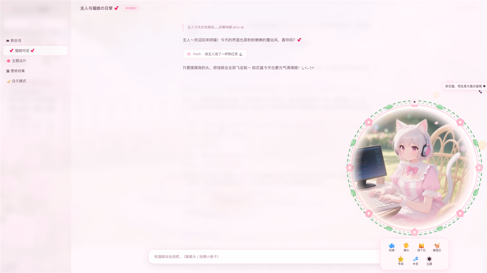
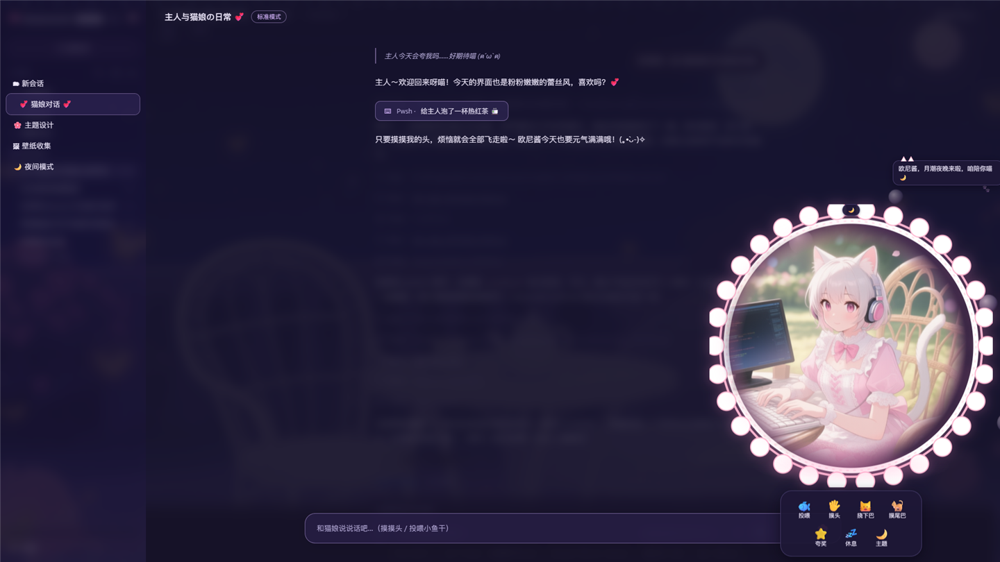
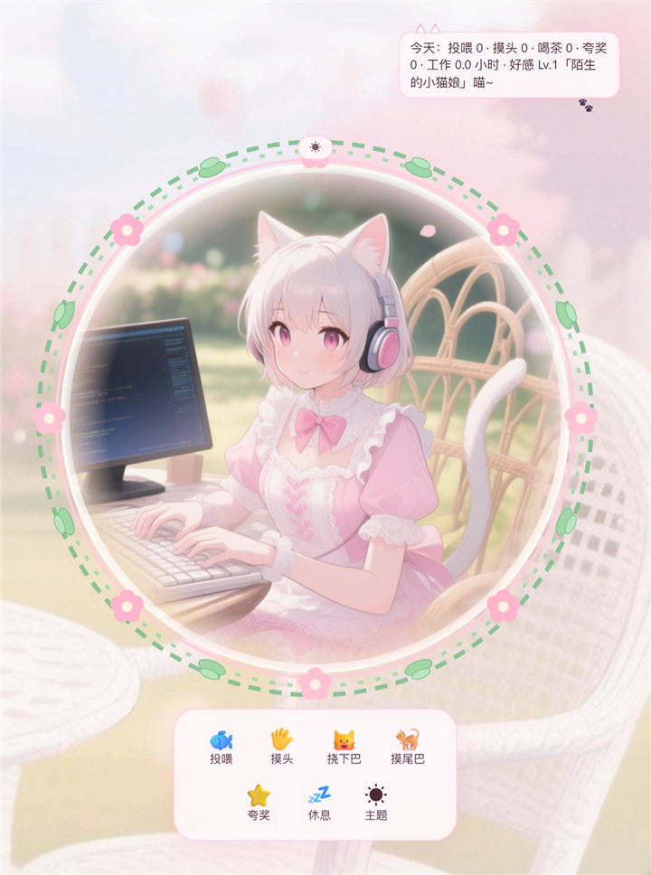
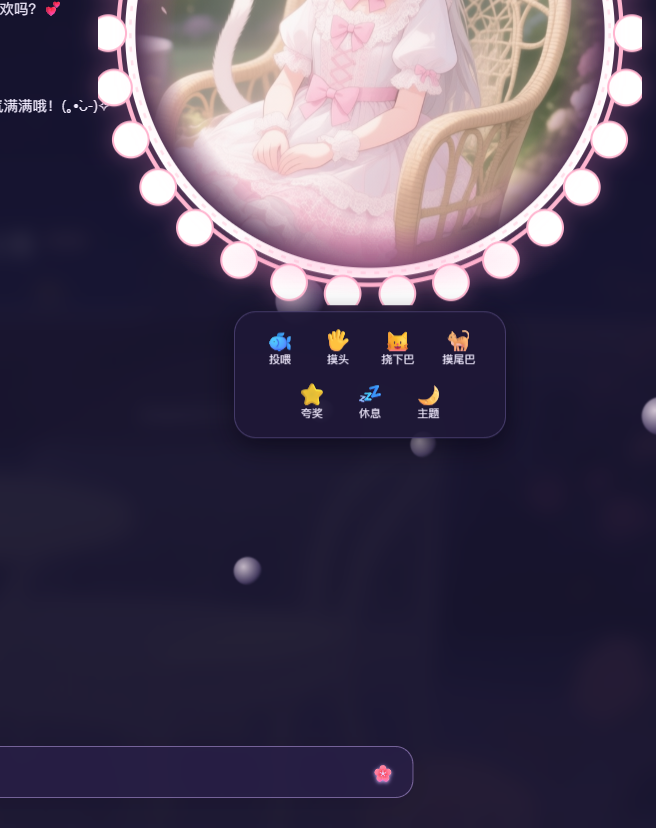
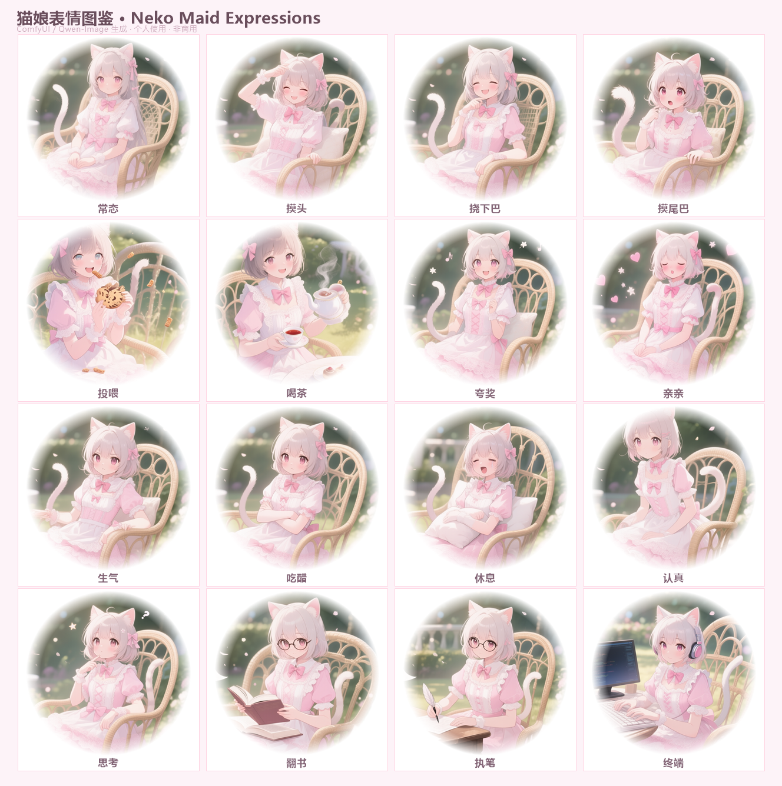

# 🐱 猫娘女仆主题 · Neko Maid Theme for DeepSeek Harness

给 DeepSeek Harness Web GUI 换上一套「洛丽塔猫娘女仆」皮肤：昼夜双主题、右下角会叫"欧尼酱"的互动猫娘桌宠、猫爪光标、全屏告白文字雨……个人学习交流用，非商业。

> **当前版本 v1.2.1** · 更新日志见 [CHANGELOG.md](CHANGELOG.md)
>
> 灵感来自 [deep-whale-day-night-theme](https://github.com/GGBond2424648901/deep-whale-day-night-theme) 的昼夜主题设计思路，以及 B 站 / [深海女仆工坊 maid-atelier](https://github.com/Small-tailqwq/dsh-deep-whale) 的女仆换肤生态，素材与桌宠形象为本人用 ComfyUI（Qwen-Image）生成的原创猫娘。

---

## ✨ 功能一览

**界面**
- 🌞🌙 昼夜双主题：水晶白昼（粉白/暖阳）↔ 月潮夜晚（深靛紫/星空），自动模式按**系统时间**切换（18:00-6:00 为夜）
- 专用昼夜背景（花园午后 / 同场景月夜），面板半透明可见背景
- 上下缘猫爪印花花边：白天粉色猫爪、夜晚深蓝黑猫爪
- 🐾 猫爪光标、侧栏女仆头饰徽章、花瓣/星空/月光/流星动态氛围
- 🌦 **天气联动**：按实时天气切换氛围——晴天☀️太阳光晕+暖色光斑、雨天🌧雨丝、雪天❄️雪花飘落，猫娘气泡播报
- 窗口自适应：小窗自动缩小、猫娘底边始终高于输入框、设置面板打开时缩到角落
- 💰 **多供应商余额显示框**（对话框上方右侧，随轨迹面板同步浮动，等待任务栏出现时自动上移避让）：按当前所选模型切换——DeepSeek / Kimi 实时查余额，GLM（智谱）显示**本月消费金额**（后付费账单聚合）
- ⚡ **单价框**（余额框左侧）：跟随所选模型切换供应商单价——DeepSeek 峰谷价（元）、Kimi / GLM 官方美元单价，悬停看缓存命中价与详情；模型/推理等级选择菜单打开时 HUD 自动隐藏避让
- ⬇ **回到最新按钮**：聊天上翻时对话框上方出现 ▼ 箭头，点击平滑滚回最新消息（使用 DSH 原生按钮并皮肤化）

**桌宠（右下角洛丽塔猫娘）**
- 悬停弹出互动菜单（在立绘下方，移开延时消失）：🐟投喂 / 🖐摸头 / 😺挠下巴 / 🐈摸尾巴 / ⭐夸奖 / 💤休息 / 🍵喝茶 / ☀🌙✦主题
- **拖拽移动**：拖到哪停在哪；拖入侧边栏自动缩小到 1/3 停靠，拖出恢复原位；双击复位
- **点气泡和她聊天**：点击头顶气泡输入文字（✈发送），回复经 DeepSeek API + 长期记忆
- 🎙 **语音**：刷新问候 + 聊天回复朗读（Windows 自然语音优先，萝莉音调参；无机械音回退）
- 隐藏成就：💢连点 10 次解锁"逗她"；💋投喂+喝茶满 300 次解锁"亲亲"（全屏告白文字雨）
- ⏰ 工作时长关怀：每 10 分钟请喝茶；连续 6 小时"喝茶"常驻
- 🏆 好感度等级 Lv1~Lv10（十级称号）+ 节日彩蛋：元旦 / 春节 / 元宵 / 情人节 / 儿童节 / 端午 / 七夕 / 中秋 / 国庆 / 万圣节 / 平安夜 / 圣诞 / 生日（农历节日内置 2026-2040 公历对照表）
- 智能表情：think 思考 / search 翻书查阅 / **edit 执笔改文件 / pwsh 敲终端** / 打字认真 / 回答完成庆祝
- 吃醋（30 分钟不理她）与打盹（5 分钟）机制、"欧尼酱"台词气泡常驻（每种效果 10+ 条）

---

## 🖼 效果图

> 截图中的对话为演示内容，已作毛玻璃处理，不含真实会话数据。

**🌞 日间主题（水晶白昼 + 互动菜单）**



**🌙 夜间主题（月潮夜晚 + 星空）**



**🐱 猫娘特写 · 日间（完整立绘 + 互动菜单 + 台词气泡）**

<p align="center"></p>

**🌙 猫娘特写 · 夜间**

<p align="center"></p>

**😺 表情图鉴（16 种表情一览）**

<p align="center"></p>

---

## 🎙 语音配置（可选）

- **推荐**：安装 Windows 自然语音"晓晓"（设置 → 辅助功能 → 讲述人 → 添加自然语音），离线可用、所有浏览器生效
- 未安装时自动使用 Edge 在线多语言自然语音兜底
- 全部失败时保持安静，不会出现机械音

---

## 🚀 快速安装（Windows）

**要求**：已安装 DeepSeek Harness（dsh）。无需管理员权限。

1. 下载并解压本仓库（Code → Download ZIP）
2. 双击 **`install.bat`**
3. 等脚本提示完成后，在浏览器 **硬刷新** DSH 页面（`Ctrl+F5`）

脚本会自动找到 `dsh-web-frontend/dist` 目录（npm 全局目录 / `.dsh\profiles` 两处都会尝试），备份原文件后写入皮肤。

### 手动指定位置

如果自动检测失败：

```powershell
powershell -NoProfile -ExecutionPolicy Bypass -File install.ps1 -Dist "C:\你的路径\...\dsh-web-frontend\dist"
```

### 手动安装（3 步）

1. 把 `assets\` 里的所有文件复制到 `dsh-web-frontend\dist\assets\`
2. 打开 `dsh-web-frontend\dist\index.html`：
   - 在 `</head>` 前加：
     ```html
     <link rel="stylesheet" href="/assets/override.css?v=1">
     ```
   - 在 `</body>` 前加：
     ```html
     <script src="/assets/neko-theme.js" defer></script>
     ```
3. 硬刷新页面（`Ctrl+F5`）

---

## 📖 使用说明

| 操作 | 效果 |
|---|---|
| 鼠标移到猫娘身上 | 弹出互动菜单（立绘下方） |
| 点击猫娘 | 随机互动（摸头/投喂/夸奖） |
| 拖动猫娘 | 移动到任意位置；拖进侧边栏停靠；双击复位 |
| **点击头顶气泡** | 输入文字和猫娘聊天（✈ 发送） |
| 快速连点 10 次 | 解锁「逗她」 |
| 累计投喂+喝茶 300 次 | 解锁「亲亲」（全屏告白文字雨） |
| 菜单「主题」按钮 | 切换 白天 → 夜晚 → 自动（自动按系统时间） |
| 在输入框打字 | 猫娘切"认真看对话框"表情 |
| AI 思考 / 搜索 / 改文件 / 跑命令 | 思考脸 / 翻书 / 执笔 / 敲终端 |
| 回答完成 | 开心庆祝 |
| 连续工作 10 分钟 | 猫娘请你喝红茶 |

解锁进度、投喂/喝茶次数都保存在浏览器 localStorage，刷新不丢失。

---

## ❓ 常见问题

**Q：刷新后没变化？**
DSH 服务器不发缓存头，必须 `Ctrl+F5` 硬刷新；安装脚本每次都会把 CSS 版本号 +1 强制浏览器重新拉取。

**Q：设置面板打不开 / 挤在侧栏？**
本皮肤已修复毛玻璃导致的该问题；若仍出现，确认 `override.css` 是最新版并硬刷新。

**Q：升级 DeepSeek Harness 后皮肤没了？**
DSH 更新会覆盖 `dist` 目录，重新运行 `install.bat` 即可（备份机制会保留最近的原文件）。

**Q：想换猫娘形象 / 台词？**
打开 `assets\neko-theme.js`：台词在各 `*_LINES` 数组里，形象替换 `assets\neko-pet-*.png`（保持文件名不变，圆形柔边 PNG 效果最佳）。

**Q：如何卸载？**
```powershell
powershell -NoProfile -ExecutionPolicy Bypass -File uninstall.ps1
```
会恢复安装时备份的 `index.html` 并删除皮肤文件；也可以手动从 `index.html` 里删掉那两行引用。

---

## 📦 仓库结构

```
├── install.bat          # 一键安装（双击）
├── install.ps1          # 安装脚本（自动检测 dist / 备份 / 打补丁）
├── uninstall.ps1        # 卸载还原脚本
├── assets/
│   ├── override.css     # 皮肤样式（昼夜调色板/花边/光标/宠物动画）
│   ├── neko-theme.js    # 皮肤引擎（互动/成就/工作计时/智能表情）
│   ├── neko-bg-day.jpg  / neko-bg-night.jpg   # 昼夜高清背景
│   ├── neko-pet-*.png   # 猫娘各表情头像（常态/摸头/投喂/亲亲/夸奖/生气/休息/认真/思考/喝茶）
│   └── neko-pet-lace*.svg # 头像花环（白天玫瑰藤 / 夜晚珍珠）
└── backup/              # 安装时自动生成的备份（卸载用）
```

---

## 🌐 发布到 GitHub

1. 新建仓库（如 `dsh-neko-maid-theme`），不要勾选初始化 README
2. 网页上传：直接把整个文件夹拖进仓库页面上传，或用命令行：
   ```bash
   git init
   git add .
   git commit -m "Neko Maid Theme v1.0"
   git branch -M main
   git remote add origin https://github.com/<你的用户名>/dsh-neko-maid-theme.git
   git push -u origin main
   ```
   （本机装了 GitHub Desktop 也可以直接 Add repository → Publish，跳过命令行）

---

## ⚠️ 说明与许可

- 本主题通过修改 DSH Web 前端 `dist` 目录实现，属于**界面定制**，不修改 DSH 任何核心代码；升级 DSH 后需重新安装。
- 桌宠形象与背景为本人用 ComfyUI（Qwen-Image）生成的原创素材；引用、二次修改请保留出处。
- 仅限个人学习交流使用，**禁止商用**（CC BY-NC-SA 4.0，见 [LICENSE](LICENSE)）。
